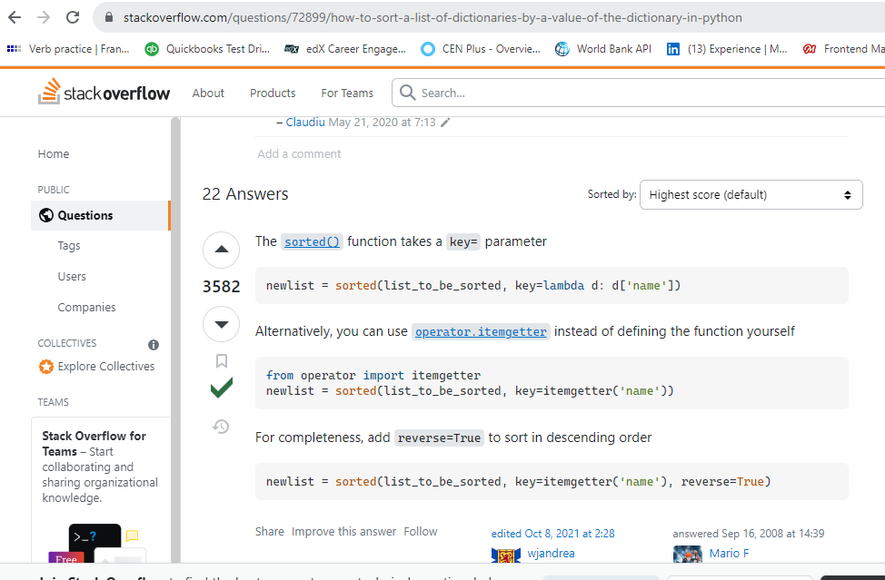
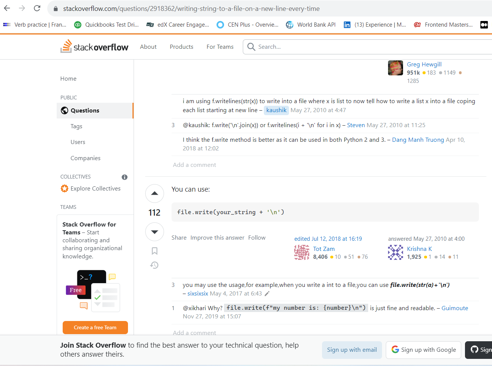

# python-challenge
Python Challenge

## References

* [Stack Overflow - How to sort a list of dictionaries](https://stackoverflow.com/questions/72899/how-to-sort-a-list-of-dictionaries-by-a-value-of-the-dictionary-in-python)

* [Stack Overflow - Ways of writing string to a file](https://stackoverflow.com/questions/2918362/writing-string-to-a-file-on-a-new-line-every-time)

* Masters.com, Geekforgeeks.com, Harvard CS50 youtube videos for small topics

* Class Notes from Python (Week 2)

* Work on Class Activities

* Tutoring session with Roberto Salazar

* Used the README.md file of Module 2 Challenge for TODO list.

* Improved code by putting in long hours and creative engineering